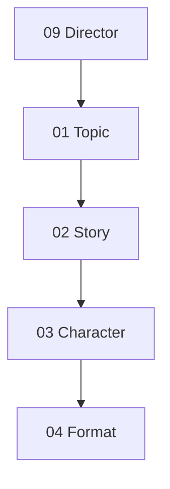

# Planning Director 파이프라인 (Phase 3A-2)

**기획 Director** (`agents/09_director_agent.py`) — 전반부 기획 오케스트레이션.  
**후반 Director** (`agents/post_production/director.py`) — 05→07 전용 (별개).

| 항목 | 상태 |
|------|------|
| `main.py` | 미연결 |
| HTTP API | 미연결 |
| UI | 미연결 |

---

## 호출 순서



```
09 Director
   ↓
01 Topic
   ↓
02 Story
   ↓
03 Character
   ↓
04 Format
```

---

## 단계별 입·출력

### 03 Character (`run_character_agent`)

| 구분 | 필드 |
|------|------|
| **입력** | `topic`, `story` (`StoryContext`), `reference_character` (`ReferenceCharacter` — `reference_characters/{name}/`) |
| **출력** | `character_profile`, `character_prompt`, `visual_constraints` |

### 04 Format (`run_format_agent`)

| 구분 | 필드 |
|------|------|
| **입력** | `story`, `target_platform`, `duration_seconds` |
| **출력** | `format_plan`, `recommended_cut_count`, `aspect_ratio` |

지원 `format_plan.format`: `shorts`, `long_video`, `slideshow`, `cartoon`, `card_news`

---

## 호출 순서 예제

### 전체 기획 파이프라인 (09 → 01 → 02 → 03 → 04)

```python
from importlib import import_module

director = import_module("agents.09_director_agent")
char = import_module("agents.03_character_agent")
story = import_module("agents.02_story_agent")

result = director.run_planning_pipeline(
    director.PlanningDirectorInput(
        main_topic="애견카페에서 다른 친구들과 신나게 노는 뽀식이",
        style="애니메이션",
        duration_seconds=20,
        cut_count=5,
        selected_subtopic_id="subtopic_1",
        selected_story_tone=story.StoryTone.COMIC,
        reference_character=char.ReferenceCharacter(name="bposik_v2"),
        target_platform="youtube_shorts",
    )
)

assert result.success
assert result.steps == [
    "09_director",
    "01_topic",
    "02_story:subtopic_1",
    "03_character",
    "04_format",
]

cr = result.character_result
assert cr.character_profile is not None
assert cr.character_prompt
assert cr.visual_constraints is not None

fr = result.format_result
assert fr.format_plan is not None
assert fr.recommended_cut_count == fr.format_plan.recommended_cut_count
assert fr.aspect_ratio == fr.format_plan.aspect_ratio
```

### 단계별 직접 호출 (Director 없이)

```python
from importlib import import_module

topic_mod = import_module("agents.01_topic_agent")
story_mod = import_module("agents.02_story_agent")
char_mod = import_module("agents.03_character_agent")
fmt_mod = import_module("agents.04_format_agent")

# 01 Topic
tr = topic_mod.run_topic_agent(
    topic_mod.TopicAgentInput(main_topic="비 오는 날 창가", style="감성", duration_seconds=20)
)

# 02 Story
sr = story_mod.run_story_agent(
    story_mod.StoryAgentInput(
        main_topic=tr.main_topic,
        subtopic=tr.subtopics[0],
        style=tr.style,
        duration_seconds=tr.duration_seconds,
        cut_count=tr.cut_count,
    )
)

ctx = char_mod.StoryContext.from_variant(
    main_topic=tr.main_topic,
    subtopic_id=tr.subtopics[0].id,
    subtopic_title=tr.subtopics[0].title,
    variant=sr.variants[0],
    cut_count=tr.cut_count,
)

# 03 Character
cr = char_mod.run_character_agent(
    char_mod.CharacterAgentInput(
        topic=tr.main_topic,
        story=ctx,
        reference_character=char_mod.ReferenceCharacter(name="bposik_v2"),
    )
)

# 04 Format
fr = fmt_mod.run_format_agent(
    fmt_mod.FormatAgentInput(
        story=ctx,
        target_platform="youtube_shorts",
        duration_seconds=tr.duration_seconds,
    )
)

print(cr.character_profile.character_name, fr.aspect_ratio, fr.recommended_cut_count)
```

### Phase 3A 호환 (01 → 02 만)

```python
from importlib import import_module

d = import_module("agents.09_director_agent")
out = d.run_topic_story_pipeline(
    d.PlanningDirectorInput(main_topic="테스트 주제", duration_seconds=15)
)
# steps: 09_director, 01_topic, 02_story:subtopic_1 (03·04 없음)
```

### 원라인 스모크

```bash
python3 -c "from importlib import import_module; print(import_module('agents.09_director_agent').example_planning_result())"
```

---

## 모듈 경로

| ID | 파일 |
|----|------|
| 01 | `agents/01_topic_agent.py` |
| 02 | `agents/02_story_agent.py` |
| 03 | `agents/03_character_agent.py` |
| 04 | `agents/04_format_agent.py` |
| 09 (기획) | `agents/09_director_agent.py` |
| 09 (후반) | `agents/post_production/director.py` |
