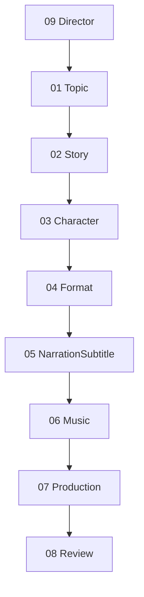

# Planning Director 파이프라인 (Phase 3A-3)

**기획·제작 Director** (`agents/09_director_agent.py`) — 01→08 Mock 오케스트레이션.  
**후반 Director** (`agents/post_production/director.py`) — main.py 연결 실구현 (별개).

| 항목 | 상태 |
|------|------|
| `main.py` | 미수정 (기존 프로덕션 라우트 유지) |
| HTTP API | **개발용** `POST /agent/run-demo` (`agents/dev_api/run_demo.py`, `app_with_dev_routes:app`) |
| UI | 미연결 |

---

## 최종 호출 흐름



```
09 Director
   ↓
01 Topic
   ↓
02 Story
   ↓
03 Character
   ↓
04 Format
   ↓
05 NarrationSubtitle
   ↓
06 Music
   ↓
07 Production
   ↓
08 Review
```

| 함수 | 범위 |
|------|------|
| `run_full_pipeline()` | 01 → 08 (Phase 3A-3 기본) |
| `run_planning_pipeline()` | 01 → 04 만 |
| `run_topic_story_pipeline()` | 01 → 02 만 |

---

## 단계별 입·출력

### 05 NarrationSubtitle

| | |
|---|---|
| 입력 | `story`, `tone`, `format` |
| 출력 | `narration_script`, `subtitle_script`, `voice_style` |

### 06 Music

| | |
|---|---|
| 입력 | `story`, `emotion`, `duration_seconds` |
| 출력 | `music_style`, `bpm`, `music_prompt` |

### 07 Production

| | |
|---|---|
| 입력 | `storyboard`, `narration`, `subtitle`, `music`, `format` |
| 출력 | `production_plan`, `render_plan` |

### 08 Review

| | |
|---|---|
| 입력 | `production_result` (`ProductionResultSnapshot`) |
| 검증 | 캐릭터 일관성, 자막·음성 존재, 길이, 출력 형식 |
| 출력 | `review_report`, `retry_target_agent` |

`retry_target_agent`: `03_character`, `05_narration_subtitle`, `06_music`, `07_production`, `04_format`, 또는 빈 문자열(통과)

### 03 · 04 (Phase 3A-2)

| 에이전트 | 입력 | 출력 |
|----------|------|------|
| 03 Character | `topic`, `story`, `reference_character` | `character_profile`, `character_prompt`, `visual_constraints` |
| 04 Format | `story`, `target_platform`, `duration_seconds` | `format_plan`, `recommended_cut_count`, `aspect_ratio` |

---

## 호출 순서 예제

### 전체 파이프라인 (01 → 08)

```python
from importlib import import_module

director = import_module("agents.09_director_agent")
story = import_module("agents.02_story_agent")

result = director.run_full_pipeline(
    director.PlanningDirectorInput(
        main_topic="애견카페에서 다른 친구들과 신나게 노는 뽀식이",
        style="애니메이션",
        duration_seconds=20,
        cut_count=5,
        project_slug="bposik_demo",
        selected_subtopic_id="subtopic_1",
        selected_story_tone=story.StoryTone.COMIC,
        target_platform="youtube_shorts",
    )
)

assert result.steps == [
    "09_director",
    "01_topic",
    "02_story:subtopic_1",
    "03_character",
    "04_format",
    "05_narration_subtitle",
    "06_music",
    "07_production",
    "08_review",
]

assert result.narration_result and result.narration_result.narration_script
assert result.music_result and result.music_result.bpm > 0
assert result.production_result and result.production_result.render_plan
assert result.review_result and result.review_result.review_report
print(result.meta.get("retry_target_agent"))  # "" if passed
```

### 기획만 (01 → 04)

```python
from importlib import import_module

d = import_module("agents.09_director_agent")
out = d.run_planning_pipeline(d.PlanningDirectorInput(main_topic="테스트 주제"))
assert "05_narration_subtitle" not in out.steps
```

### 원라인 스모크

```bash
python3 -c "from importlib import import_module; print(import_module('agents.09_director_agent').example_full_pipeline_result())"
```

### HTTP 데모 API (Mock, OpenAI/Replicate 없음)

서버: `python start_server.py` 또는 `uvicorn app_with_dev_routes:app --port 8011`

```bash
curl -s -X POST http://127.0.0.1:8011/agent/run-demo \
  -H "Content-Type: application/json" \
  -d '{"main_topic":"애견카페에서 신나게 노는 뽀식이","style":"애니메이션","duration_seconds":20,"selected_subtopic_id":"subtopic_1","selected_story_tone":"comic"}' | python3 -m json.tool
```

응답 형태:

```json
{
  "success": true,
  "steps": ["09_director", "01_topic", "02_story:subtopic_1", "03_character", "04_format", "05_narration_subtitle", "06_music", "07_production", "08_review"],
  "topic": { "...": "..." },
  "story": { "...": "..." },
  "character": { "...": "..." },
  "format": { "...": "..." },
  "meta": { "mode": "mock_full_pipeline", "review_passed": true }
}
```

---

## 모듈 경로

| ID | Mock (Phase 3A) | Phase 1 실구현 |
|----|-----------------|----------------|
| 05 | `agents/05_narration_subtitle_agent.py` | `agents/post_production/narration_subtitle.py` |
| 06 | `agents/06_music_agent.py` | (향후 `audio_pipeline/bgm_generator`) |
| 07 | `agents/07_production_agent.py` | `agents/post_production/production.py` |
| 08 | `agents/08_review_agent.py` | (예정) |
| 09 기획 | `agents/09_director_agent.py` | — |
| 09 후반 | — | `agents/post_production/director.py` |
